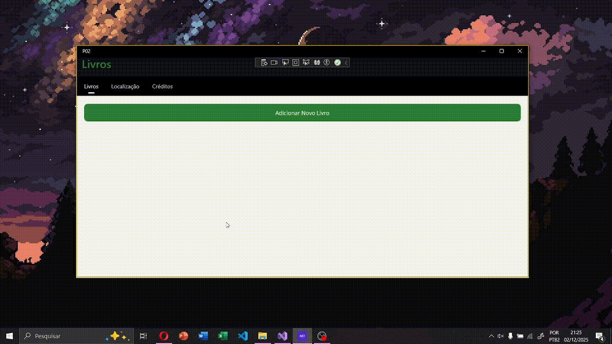

# 📚 Aplicativo de Cadastro de Livros - PROVA II

## 📝 Descrição do Projeto

Este projeto consiste em uma aplicação móvel e desktop (utilizando **.NET MAUI**) desenvolvida para a gestão completa de um catálogo de livros. A aplicação permite aos usuários **criar**, **editar**, **excluir** e **listar** registros de livros, com todos os dados persistidos localmente em um banco de dados **SQLite**.

---

## 🎬 Demonstração

---

### Requisitos Funcionais

O aplicativo gerencia as seguintes informações para cada livro:

* **Nome do Livro**
* **Nome do Autor**
* **E-mail do Autor**
* **ISBN**

---

## ✨ Funcionalidades Principais

* **CRUD Completo:** Suporte total às operações de Criação, Leitura (Listagem), Atualização e Exclusão de registros de livros.
* **Persistência de Dados:** Utilização do **SQLite** para armazenamento local e eficiente dos dados.
* **Design Responsivo:** Aplicação desenvolvida com foco no *Layout* (Layouts e Estilos) para uma apresentação clara e agradável em diferentes plataformas.
* **Recurso Bônus (Localização):** Implementação de um botão que exibe a **localização geográfica atual** do dispositivo, apresentando as coordenadas (Latitude e Longitude) ou um mapa. *Este recurso é um diferencial para nota máxima.*
  
---

## 🔑 Autores

**Aluna:** Laysa Bernardes Campos da Rocha - CB3024873  
**Aluno:** Lucas Lopes Cruz - CB3025284

